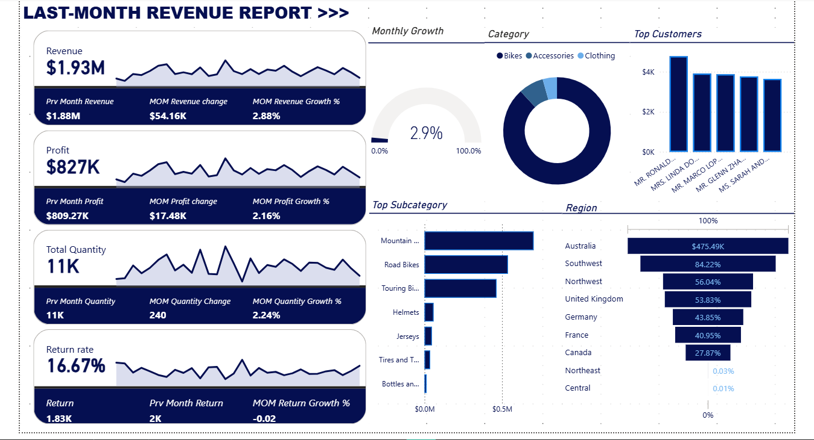
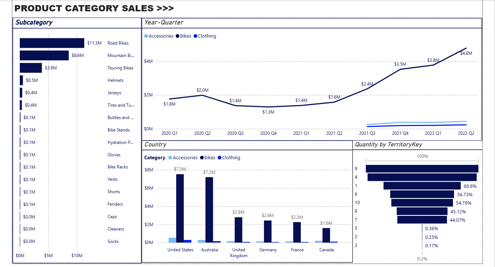

# Monthly Revenue & Product Sales Performance Report

## Project Overview
This project features a multi-page **Power BI** dashboard designed to track and analyze the financial performance of a retail operation for a specific monthly period. The report provides a "gangan" (major) overview of revenue streams, profitability, and customer behavior to help management optimize sales strategies.

## Key Performance Indicators (KPIs)
* **Revenue Growth**: Achieved a total monthly revenue of **$1.93M**, reflecting a **2.88% Month-Over-Month (MOM) increase**.
* **Profitability**: Generated **$827K in total profit**, with a positive MOM profit growth of **2.16%**.
* **Operational Volume**: Successfully managed a total quantity of **11K items** with a return rate of **16.67%**.
* **Regional Dominance**: **Australia** emerged as the top-performing territory, contributing **$475.49K** to the total revenue.

## Sales & Product Insights
* **Top Categories**: **Bikes** remain the primary revenue driver, specifically **Road Bikes ($11.3M lifetime)** and **Mountain Bikes ($8.6M lifetime)**.
* **Growth Trends**: The dashboard tracks a steady upward trajectory in sales from 2020 through Q2 2022, peaking at **$4.8M** in the most recent quarter.
* **Customer Segmentation**: Identified top individual contributors, such as Mr. Ronald Young and Mrs. Linda Mitchell, as high-value clients.

## Technical Implementation
* **Dynamic Time-Series Analysis**: Used to calculate MOM changes and percentage growth for revenue and profit.
* **Advanced Visualizations**:
    * **Funnel Charts**: To visualize regional revenue distribution.
    * **Gauge Charts**: For tracking monthly growth targets against 100% benchmarks.
    * **Clustered Bar & Line Charts**: For comparing subcategory sales against quarterly trends.
* **Interactive Filtering**: Stakeholders can filter data by **Category** (Bikes, Accessories, Clothing) and **Territory**.

## Visuals

